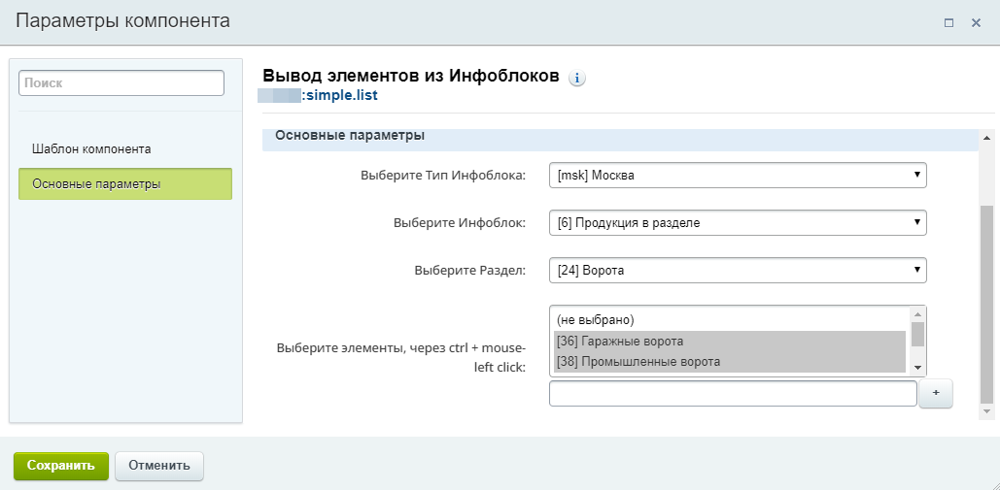

# 1C-Bitrix компонент Simple.list выводит выбранные элементы из ИБ
1. Выводить все элементы инфоблока если выбран только тип ИБ
2. 

## Установка компонента
1. Скачайте или клонируйте репозиторий
2. Раздел с названием simple.list нужно загрузить на сайт по адресу /local/components/пространство имен/
3. Обновите компоненты в визуальном редакторе.

## Параметры компонента .parameters.php
1. Выбор типа инфоблока, выводит все типы инфоблоков, обязателен для выбора.
2. Выбор инфоблока, выводит все инфоблоки выбранного типа инфоблока, обязателен.
3. Выбор раздела, выводит разделы первого уровня выбранного инфоблока если такие присутствуют, не обязателен.
2. Выбор элементов, выводит все элементы раздела если раздел выбран если нет то выводит все элементы инфоблока, выбор элементов через ctrl + mouse-left click.

## Требования к системе 1C-Bitrix для корректной работы компонента
1. Редакция 1C-Bitrix - не имеет значения
2. Версия 1C-Bitrix не менее 14.0
3. Установленный модуль Инфоблоков